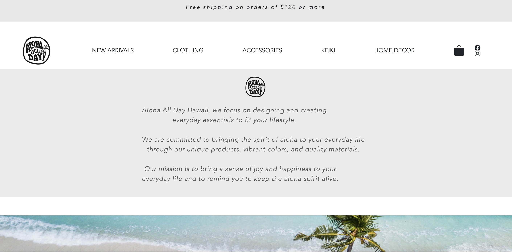

<div class="text-center p-4">
  
</div>

For this project, I was tasked with replicating elements from a pre-existing website. I chose to use the website for the brand Aloha All Day Hawaii. I replicated the website’s shipping banner, navbar, slogan banner, palm banner, and footer using the Next.js template. 


The slogan banner on the site featured the company's mission statement, as well as their logo. The code below showcases the component I came up with to duplicate the original website's banner. 

```cpp
const BrandText = () => (
  <Navbar className="navbar navbar-expand-sm bg-light" id="textNavbar">
    <Nav className="row" id="brandText">
      <Image id="smallerLogo" src="/logo.webp" />
      <Nav>
        Aloha All Day Hawaii, we focus on designing and creating
        <br />
        everyday essentials to fit your lifestyle.
        <br />
      </Nav>

      <Nav>
        <br />
        We are committed to bringing the spirit of aloha to your everyday life
        <br />
        through our unique products, vibrant colors, and quality materials.
        <br />
      </Nav>

      <Nav>
        <br />
        Our mission is to bring a sense of joy and happiness to your
        <br />
        everyday life and to remind you to keep the aloha spirit alive.
      </Nav>
    </Nav>
  </Navbar>
);
```

Another component I utilized for this project was the TopNavbar component. Below is the code for that component. 
```cpp
 const TopNavbar = () => (
  <Navbar id="topNavbar">
    <Container className="d-flex justify-content-between align-items-center">
      <Image id="logo" src="/logo.webp" alt="Company Logo" width={50} height={50} />

      <Nav id="topNavbarText">
        <div>NEW ARRIVALS</div>
      </Nav>

      <Nav id="topNavbarText">
        <div>CLOTHING</div>
      </Nav>

      <Nav id="topNavbarText">
        <div>ACCESSORIES</div>
      </Nav>

      <Nav id="topNavbarText">
        <div>KEIKI</div>
      </Nav>

      <Nav id="topNavbarText">
        <div>HOME DECOR</div>
      </Nav>

      <div className="d-flex align-items-center">
        <div style={{ position: 'relative', display: 'inline-block', zIndex: 1 }}>
          <div style={{ position: 'relative' }}>
            <BagFill size={30} />
          </div>
        </div>
        <div className="row">
          <Facebook className="me-3" />
          <Instagram />
        </div>
      </div>

    </Container>
  </Navbar>
);
```

This project strengthened my web design skills, as well as my familiarity with React and Javascript. It required me to pay close attention to detail, which both challenged and excited me. Ultimately, I feel this project better prepared me for my future in web design and development. 
