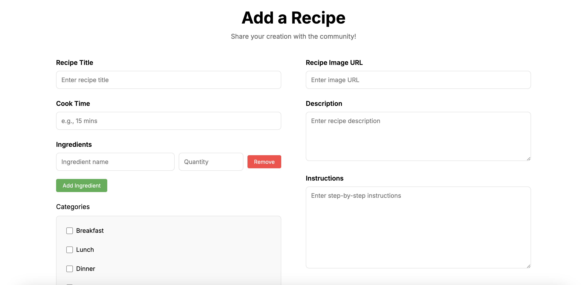
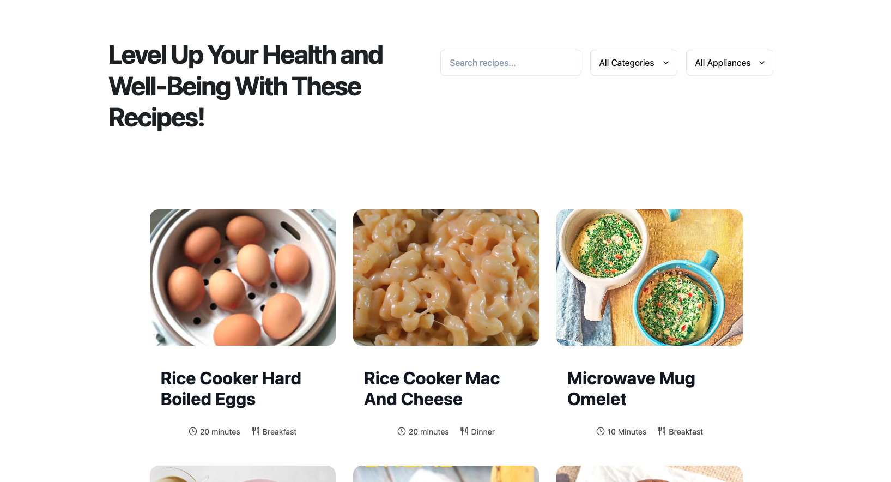
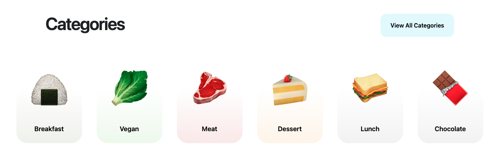

I built this website with some friends for a software engineering class in my sophomore year of college. We developed a website that contained a database of recipes that could be made in a college student’s dorm room, using cooking appliances such as a rice cooker, panini press, or microwave. The website allows users to create an account, add recipes to the database, search recipes, as well as view recipes uploaded by others. 

While each of the members of our group contributed to both the front and back ends of our project, I mainly focused on the front end. I completed tasks such as creating the Recipes and Add Recipe pages, as well as creating functioning elements such as the search bar which searches the database for a key term, and the Categories elements which display a filtered database result depending on the category chosen. 

Below is a screenshot of the Add Recipe page on the site. It provides users with the ability to add components such as an image, a description, and categories the recipe falls into. 

  

Below is a screenshot of the Recipes page on the site. It showcases all of the recipes in the database, and allows users to search for a specific recipe, or to search by category or appliance. 

  

Below is a screenshot of the Categories element on the Home page of the site. It features various category buttons the user can click to take them to a page featuring recipes in the chosen category. 

  

This project taught me how to design and manage a database, create functioning user interfaces, and work collaboratively with partners to create a functioning website. It significantly improved my comfort level with working on full stack projects, and taught me many valuable skills. It has encouraged me to continue working on web applications and improving my skills further. This website can be found at https://campus-cooking.vercel.app/.
