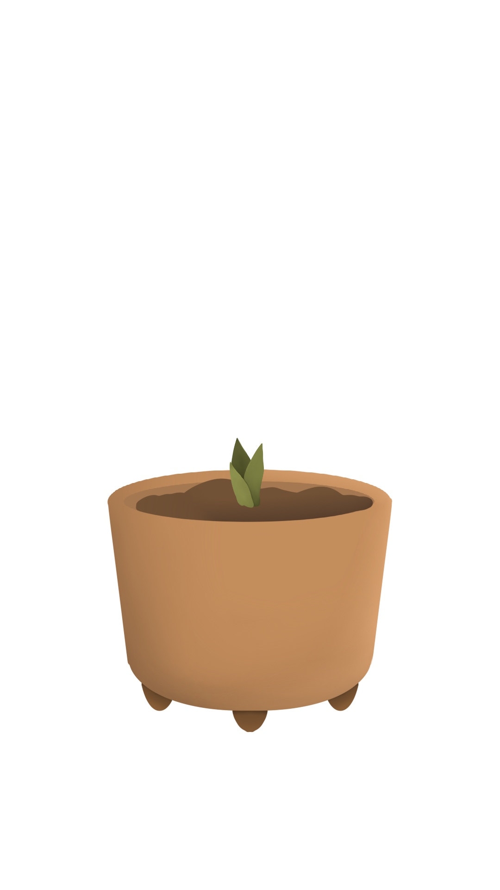

  
  

Habit Garden is an iOS app I’m currently developing with a friend. While I handle the coding, she’s creating all of the digital artwork for the app.

Before beginning this project, I had never worked with Swift, the coding language used for iOS development. I originally spent 1 week learning the basics, and have continued to learn additional concepts as I work on the app. While I typically learn new coding languages quickly, Swift has been a humbling challenge. Still, my excitement for building this app keeps me motivated and committed to learning.

Habit Garden creates a virtual environment where users can track positive habits. Each habit is linked to a plant that grows when the user completes the habit for the day. As the user stays consistent with their habit, their plant will grow. On the other hand, neglecting the habit for three days causes the plant to wilt. If the habit is not completed within five days, it will die. As my friend and I learn more and cultivate more ideas, we plan on adding additional features to Habit Garden.

Below are pictures of the plant as it grows: 
  
  

